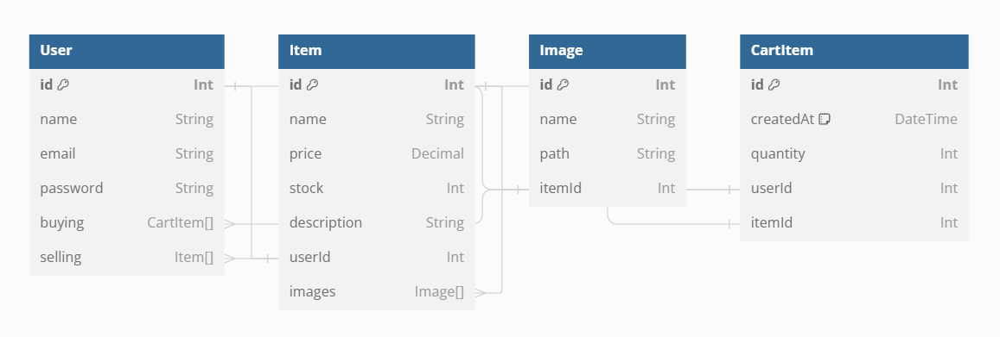

# MyMarket

**Link to URL:** [https://my-market-frontend.onrender.com](https://my-market-frontend.onrender.com)

**Description:**  
MyMarket is a minimalistic marketplace application designed with React and PostgreSQL.  
The application focuses on efficiency and provides a seamless user experience for buying and managing items.

**Features:**
- Search for items
- Add and remove items from the marketplace
- User login and logout
- Add items to cart and proceed to checkout

**Tests:**
- Comprehensive testing of item search functionality
- Validation of add/remove item processes
- User authentication and session management tests
- Cart management and checkout process testing

**Landing Page:**  
The landing page displays available items. Users can click on an item to view details, add it to their cart, and proceed to checkout.

**Schema Design:**

</img>

**API:**
- Developed a custom API for interacting with a PostgreSQL database.
- API supports adding/removing items, managing cart items, and handling user data.
- Efficient query handling and logic processing are integrated.

**Stack:**
- PostgreSQL
- Express
- React
- Node.js

**Reflection:**  
This project was a valuable learning experience.  
I gained significant insights into full-stack development and am pleased with the results.  
The hands-on experience with the PERN stack was particularly rewarding.
